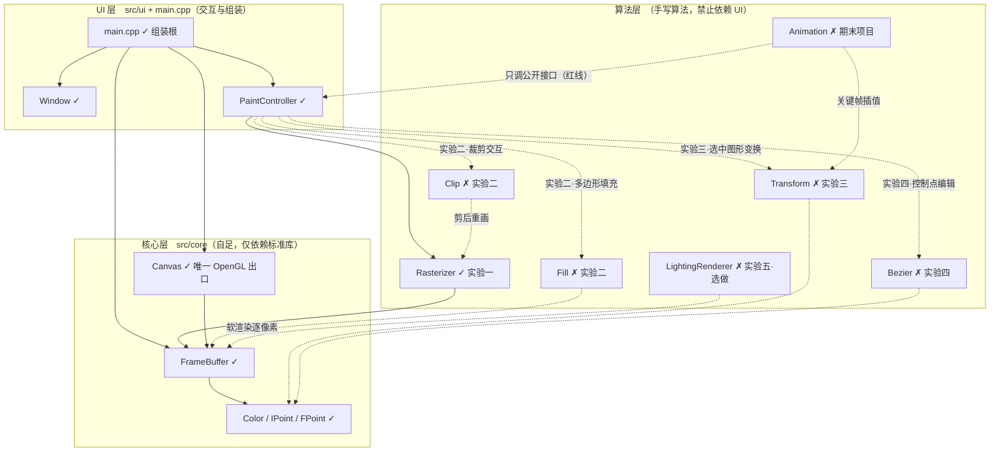
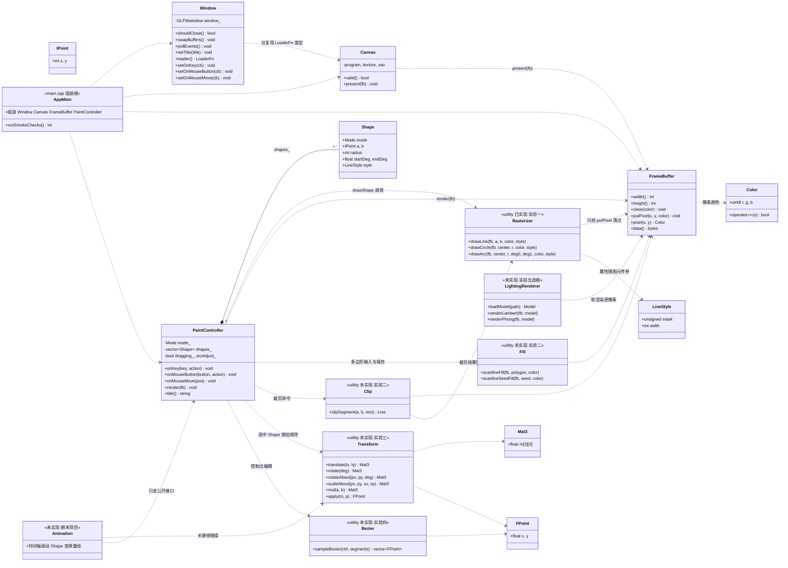

# 架构设计（类图与依赖）

> 本文随代码演进同步更新。✓ = 已实现；✗ = 未实现（标注所属实验）。期末报告"程序结构设计"章节以本文为底稿。

## 1. 分层总览

实线 = 当前已存在的依赖；虚线 = 未来模块接入后的依赖。

## 2. 类图

工具函数（raster 等命名空间下的自由函数）以 `<<utility>>` 类表示。

## 3. 依赖规则（红线）

| 规则 | 内容 |
|---|---|
| 允许方向 | main → 各层；ui → raster/geom/curves/core；raster/geom/curves → core；core 不依赖任何本仓库模块 |
| 禁止反向 | 算法层（raster/geom/curves）**不得** include `src/ui` 下任何头文件 |
| OpenGL 边界 | 仅 `Canvas` 使用 OpenGL/glad（LoaderFn 由 Window 注入），其余代码与 GL 无关 |
| GLFW 边界 | 仅 `Window` 使用 GLFW；算法层经回调收到的是纯 int/float 事件 |
| 画点入口 | 一切绘制最终经 `FrameBuffer::putPixel`（课程红线：算法手写） |
| 期末项目 | Animation 只调 PaintController 公开接口驱动图形，不改引擎内部 |

## 4. 未来模块接入说明

- **实验二 Fill/Clip**：与 Rasterizer 同模式（自由函数 + FrameBuffer 参数）；PaintController 增加多边形顶点输入状态机与裁剪命令；`Shape` 扩展 `polygon` 顶点表字段。
- **实验三 Transform**：实现 Mat3 全套；PaintController 增加图形选中（点选/框选）与变换命令，参考点默认图形重心、支持任意点。**设计决策点**：线段/多边形直接变换顶点；圆/圆弧需"变换圆心 + 缩放半径"的参数化处理（届时在 issue 里定）。
- **实验四 Bezier**：de Casteljau 采样后由 PaintController 用 `raster::drawLine` 连线显示；`Shape` 扩展控制点表，控制点可拖拽实时重采样。
- **实验五（选做）LightingRenderer**：独立三维支线，仅依赖 FrameBuffer 软渲染（Lambert/Phong 逐像素），不与 2D 交互耦合；模型文件放 `assets/`。
- **期末项目 Animation**：时间轴/关键帧驱动 Shape 列表做变换，复用实验三矩阵与实验一图元；只走公开接口。

## 5. 已知架构债（后续顺手清理）

1. `Window.hpp` 为复用 `LoaderFn` 而 include 了 `Canvas.hpp`——把 LoaderFn 挪到独立小头（如 `core/Loader.hpp`）即可解开，实验二重构时处理。
2. `PaintController` 是交互中枢，实验三/四接入后职责会膨胀——届时视情况拆出 `ShapeDocument`（图形列表+选中）与工具类。
3. `Shape` 用参数化字段存圆/弧，实验三变换时需按类型分支处理（见上文设计决策点）。
