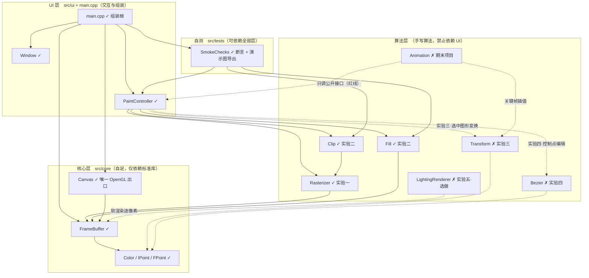
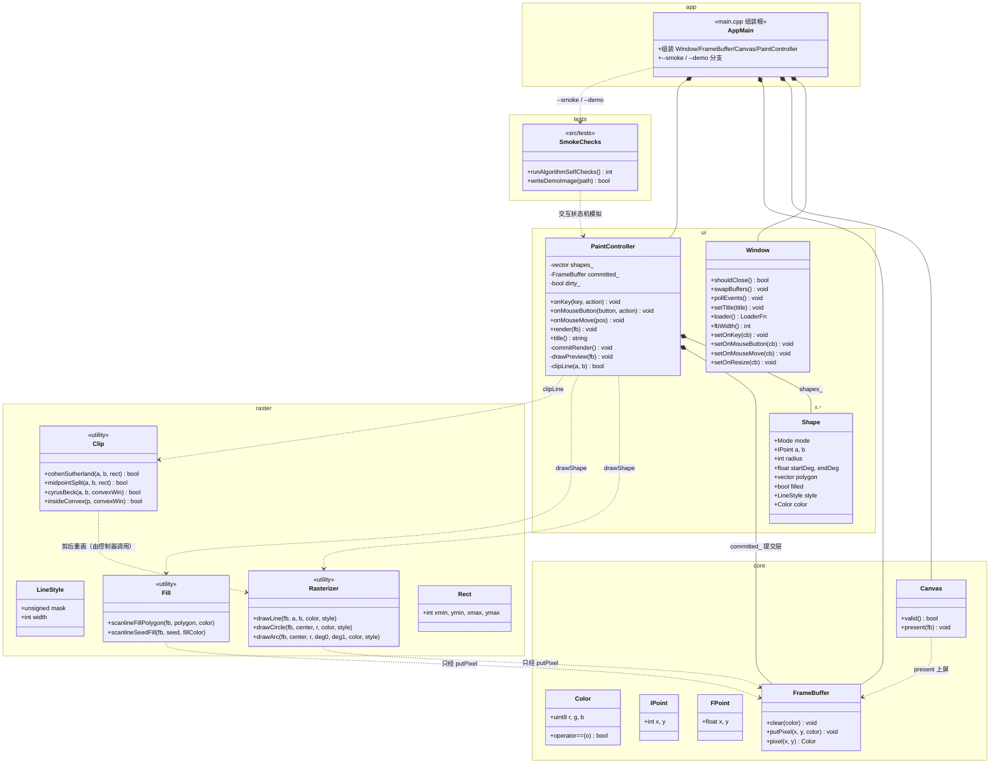
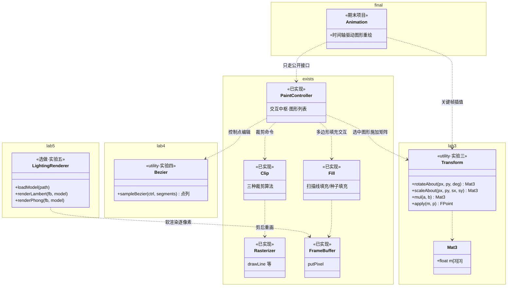

# 架构设计（类图与依赖）

> 本文随代码演进同步更新。✓ = 已实现；✗ = 未实现（标注所属实验）。期末报告"程序结构设计"章节以本文为底稿。

## 1. 分层总览

实线 = 当前已存在的依赖；虚线 = 未来模块接入后的依赖。

```mermaid
graph TB
    subgraph UI["UI 层　src/ui + main.cpp（交互与组装）"]
        MAIN["main.cpp ✓ 组装根"]
        WIN["Window ✓"]
        PC["PaintController ✓"]
    end
    subgraph ALG["算法层　（手写算法，禁止依赖 UI）"]
        RAS["Rasterizer ✓ 实验一"]
        FILL["Fill ✓ 实验二"]
        CLIP["Clip ✓ 实验二"]
        TRA["Transform ✗ 实验三"]
        BEZ["Bezier ✗ 实验四"]
        LIGHT["LightingRenderer ✗ 实验五·选做"]
        ANIM["Animation ✗ 期末项目"]
    end
    subgraph CORE["核心层　src/core（自足，仅依赖标准库）"]
        FB["FrameBuffer ✓"]
        CAN["Canvas ✓ 唯一 OpenGL 出口"]
        CP["Color / IPoint / FPoint ✓"]
    end
    subgraph TEST["自测　src/tests（可依赖全部层）"]
        SMOKE["SmokeChecks ✓ 断言 + 演示图导出"]
    end

    MAIN --> WIN
    MAIN --> PC
    MAIN --> CAN
    MAIN --> FB
    MAIN --> SMOKE
    PC --> RAS
    PC --> FILL
    PC --> CLIP
    RAS --> FB
    FILL --> FB
    CLIP --> RAS
    CAN --> FB
    FB --> CP
    SMOKE --> FILL
    SMOKE --> CLIP
    SMOKE --> PC

    PC -. 实验三·选中图形变换 .-> TRA
    PC -. 实验四·控制点编辑 .-> BEZ
    ANIM -. 只调公开接口（红线） .-> PC
    ANIM -. 关键帧插值 .-> TRA
    TRA -.-> CP
    BEZ -.-> CP
    LIGHT -. 软渲染逐像素 .-> FB
```

## 2. 类图（按功能分包）

### 2.1 当前类图

按功能模块分色分块（core / raster / ui / app）。为保持图面清爽，**值类型的字段依赖不画**（如 `Shape` 含 `LineStyle`/`IPoint` 字段、`FrameBuffer` 用 `Color`），只画组装与调用关系；完整约束见第 3 节。

```mermaid
classDiagram
    direction TB

    namespace core {
        class Color {
            +uint8 r, g, b
            +operator==(o) bool
        }
        class IPoint {
            +int x, y
        }
        class FPoint {
            +float x, y
        }
        class FrameBuffer {
            +clear(color) void
            +putPixel(x, y, color) void
            +pixel(x, y) Color
        }
        class Canvas {
            +valid() bool
            +present(fb) void
        }
    }

    namespace raster {
        class LineStyle {
            +unsigned mask
            +int width
        }
        class Rasterizer {
            <<utility>>
            +drawLine(fb, a, b, color, style)
            +drawCircle(fb, center, r, color, style)
            +drawArc(fb, center, r, deg0, deg1, color, style)
        }
        class Fill {
            <<utility>>
            +scanlineFillPolygon(fb, polygon, color)
            +scanlineSeedFill(fb, seed, fillColor)
        }
        class Rect {
            +int xmin, ymin, xmax, ymax
        }
        class Clip {
            <<utility>>
            +cohenSutherland(a, b, rect) bool
            +midpointSplit(a, b, rect) bool
            +cyrusBeck(a, b, convexWin) bool
            +insideConvex(p, convexWin) bool
        }
    }

    namespace ui {
        class Window {
            +shouldClose() bool
            +swapBuffers() void
            +pollEvents() void
            +setTitle(title) void
            +loader() LoaderFn
            +fbWidth() int
            +setOnKey(cb) void
            +setOnMouseButton(cb) void
            +setOnMouseMove(cb) void
            +setOnResize(cb) void
        }
        class Shape {
            +Mode mode
            +IPoint a, b
            +int radius
            +float startDeg, endDeg
            +vector polygon
            +bool filled
            +LineStyle style
            +Color color
        }
        class PaintController {
            -vector shapes_
            -FrameBuffer committed_
            -bool dirty_
            +onKey(key, action) void
            +onMouseButton(button, action) void
            +onMouseMove(pos) void
            +render(fb) void
            +title() string
            -commitRender() void
            -drawPreview(fb) void
            -clipLine(a, b) bool
        }
    }

    namespace app {
        class AppMain {
            <<main.cpp 组装根>>
            +组装 Window/FrameBuffer/Canvas/PaintController
            +--smoke / --demo 分支
        }
    }

    namespace tests {
        class SmokeChecks {
            <<src/tests>>
            +runAlgorithmSelfChecks() int
            +writeDemoImage(path) bool
        }
    }

    AppMain *-- Window
    AppMain *-- Canvas
    AppMain *-- FrameBuffer
    AppMain *-- PaintController
    AppMain ..> SmokeChecks : --smoke / --demo
    Canvas ..> FrameBuffer : present 上屏
    Rasterizer ..> FrameBuffer : 只经 putPixel
    Fill ..> FrameBuffer : 只经 putPixel
    Clip ..> Rasterizer : 剪后重画（由控制器调用）
    PaintController *-- "0..*" Shape : shapes_
    PaintController *-- FrameBuffer : committed_ 提交层
    PaintController ..> Rasterizer : drawShape
    PaintController ..> Fill : drawShape
    PaintController ..> Clip : clipLine
    SmokeChecks ..> PaintController : 交互状态机模拟
```

### 2.2 未来接入图

未来模块按所属实验分包；`exists` 包是被接入的已实现类（只列名）。

```mermaid
classDiagram
    direction TB

    namespace exists {
        class PaintController {
            <<已实现>>
            交互中枢·图形列表
        }
        class Rasterizer {
            <<已实现>>
            drawLine 等
        }
        class Fill {
            <<已实现>>
            扫描线填充/种子填充
        }
        class Clip {
            <<已实现>>
            三种裁剪算法
        }
        class FrameBuffer {
            <<已实现>>
            putPixel
        }
    }

    namespace lab3 {
        class Mat3 {
            +float m[3][3]
        }
        class Transform {
            <<utility·实验三>>
            +rotateAbout(px, py, deg) Mat3
            +scaleAbout(px, py, sx, sy) Mat3
            +mul(a, b) Mat3
            +apply(m, p) FPoint
        }
    }

    namespace lab4 {
        class Bezier {
            <<utility·实验四>>
            +sampleBezier(ctrl, segments) 点列
        }
    }

    namespace lab5 {
        class LightingRenderer {
            <<选做·实验五>>
            +loadModel(path)
            +renderLambert(fb, model)
            +renderPhong(fb, model)
        }
    }

    namespace final {
        class Animation {
            <<期末项目>>
            +时间轴驱动图形重绘
        }
    }

    PaintController ..> Fill : 多边形填充交互
    PaintController ..> Clip : 裁剪命令
    Fill ..> FrameBuffer
    Clip ..> Rasterizer : 剪后重画
    PaintController ..> Transform : 选中图形施加矩阵
    Transform ..> Mat3
    PaintController ..> Bezier : 控制点编辑
    LightingRenderer ..> FrameBuffer : 软渲染逐像素
    Animation ..> PaintController : 只走公开接口
    Animation ..> Transform : 关键帧插值
```

## 3. 依赖规则（红线）

| 规则 | 内容 |
|---|---|
| 允许方向 | main → 各层；ui → raster/geom/curves/core；raster/geom/curves → core；core 不依赖任何本仓库模块；tests 可依赖全部层（仅测试用，不参与运行时） |
| 禁止反向 | 算法层（raster/geom/curves）**不得** include `src/ui` 下任何头文件 |
| OpenGL 边界 | 仅 `Canvas` 使用 OpenGL（自写加载器 GLLoader，LoaderFn 由 Window 注入），其余代码与 GL 无关 |
| GLFW 边界 | 仅 `Window` 使用 GLFW；算法层经回调收到的是纯 int/float 事件 |
| 画点入口 | 一切绘制最终经 `FrameBuffer::putPixel`（课程红线：算法手写） |
| 渲染分层 | `PaintController` 分"提交层（图形列表重绘，变化时才重算）+ 预览层（每帧叠加）"；种子填充等算法不每帧重放 |
| 期末项目 | Animation 只调 PaintController 公开接口驱动图形，不改引擎内部 |

## 4. 未来模块接入说明

- **实验三 Transform**：实现 Mat3 全套；PaintController 增加图形选中（点选/框选）与变换命令，参考点默认图形重心、支持任意点。**设计决策点**：线段/多边形直接变换顶点；圆/圆弧需"变换圆心 + 缩放半径"的参数化处理（届时在 issue 里定）。
- **实验四 Bezier**：de Casteljau 采样后由 PaintController 用 `raster::drawLine` 连线显示；`Shape` 扩展控制点表，控制点可拖拽实时重采样。
- **实验五（选做）LightingRenderer**：独立三维支线，仅依赖 FrameBuffer 软渲染（Lambert/Phong 逐像素），不与 2D 交互耦合；模型文件放 `assets/`。
- **期末项目 Animation**：时间轴/关键帧驱动 Shape 列表做变换，复用实验三矩阵与实验一/二图元；只走公开接口。

## 5. 已知架构债（后续顺手清理）

1. `Window.hpp` 为复用 `LoaderFn` 而 include 了 `Canvas.hpp`——`LoaderFn` 已移至 `core/GLLoader.hpp`，把 `Window.hpp` 的 include 改为 GLLoader.hpp 即可彻底解开（顺手清理项）。
2. `PaintController` 是交互中枢，实验三/四接入后职责会继续膨胀——届时视情况拆出 `ShapeDocument`（图形列表+选中）与工具类。
3. `Shape` 用参数化字段存圆/弧，实验三变换时需按类型分支处理（见上文设计决策点）。
4. 种子填充以画板像素为操作对象（教材做法）：若后续引入反走样（CH4）使边界出现过渡色，需改为"按边界色判据"的填充。

## 附：交互状态机（实验一/二）

| 模式（键） | 交互 |
|---|---|
| 直线/圆（1/2） | 左键拖拽：按下定起点（圆心），移动预览，松开提交 |
| 圆弧（3） | 两阶段：拖拽定圆心/半径/起点角 → 移动调终止角 → 左键确认 |
| 多边形（4） | 左键连点加顶点（橡皮筋预览）→ 右键闭合（≥3 点）；`F` 切填充/仅轮廓 |
| 种子填充（5） | 左键点击封闭区域内一点即填充；`X` 循环填充色 |
| 裁剪（6） | 左键拖拽画线；`K`+拖拽设矩形窗口；`P`+连点+右键闭合设凸多边形窗口；`M` 切换 C-S/中点分割 |
